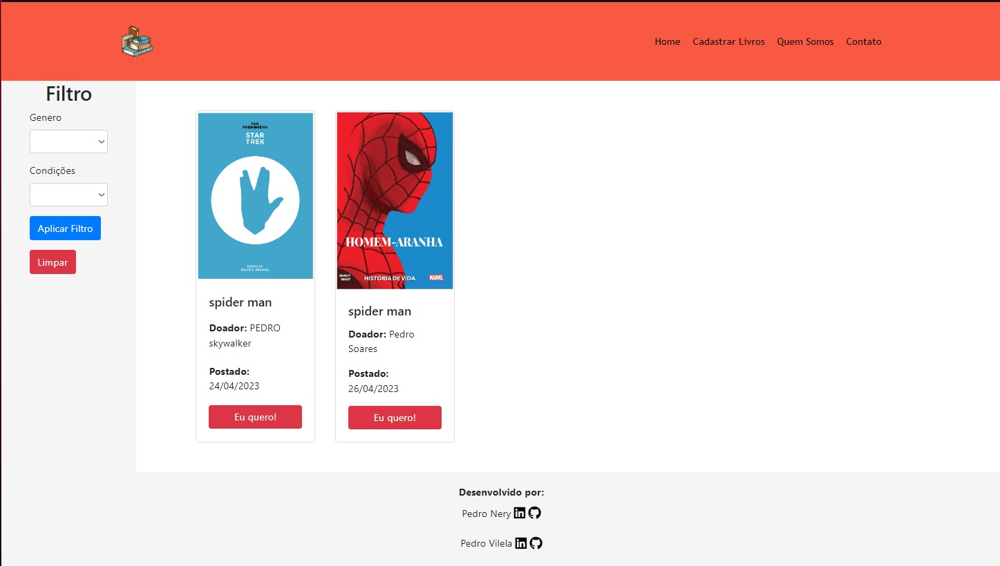

#   Projeto AdoBook
## Universidade Veiga de Almeida - RJ

### Projeto realizado para avaliação de desenvolvimento para WEB administrado em 2023.
### Desenvolvido por <a href="https://github.com/PedroNerySoares">Pedro Nery</a>   e <a href="https://github.com/pedro7vilela">Pedro Vilela</a>

#
## Stacks utilizados

# 
## Como Rodar
### º Baixar WAMP e instalar em maquina local;
### º Após baixado e instalado, salve o projeto na pasta WWW (geralmente fica em no path C:\wamp64\www);
### º Rode o WAMP  e após 3 serviços estiverem executando, aceesse  http://localhost/phpmyadmin/index.php;
### º Após acessar, importe o Arquivo EstruturaTabela.sql localizado na pasta do projeto;
### º Após esse passo-a-passo, aplicação estará pronto para ser executada. Para acessar geralmente é o caminho: http://localhost/web_final/;

  

#  Template

